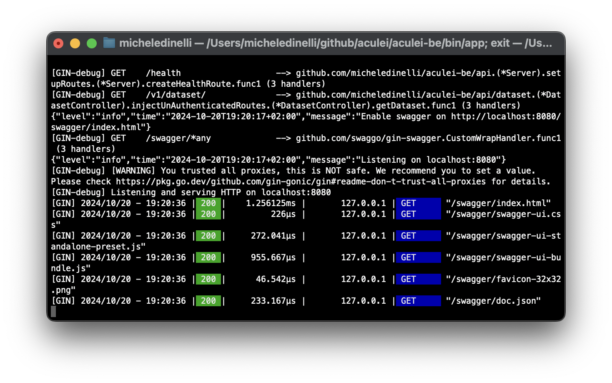

# aculei-be


Server for [`aculei.xyz`](https://aculei.xyz)

## Install

### 

Clone the repository

```console
git clone https://github.com/aculei/aculei-be.git
```

### 

```console
docker pull ghcr.io/aculei/aculei-be:main
```

## Run

### 

At `root` of the project run

```console
go run main.go
```

or if you have [task](https://taskfile.dev/installation/) installed

```console
task run
```

### 

```console
docker run -d -p 8080:8080 ghcr.io/aculei/aculei-be:main
```

Platform specific

```console
docker run -d -p 8080:8080 ghcr.io/aculei/aculei-be:main --platform linux/amd64
```

[](https://taskfile.dev/installation/)

Install `task` (installation guide [here](https://taskfile.dev/installation/)). Then at `root` of the project run

```console
task build
```

Then under `/bin` you'll see a binary file, just open it and you'll have the backend up and running

<!--  -->

## Documentation

Swagger available at `host`/swagger/index.html
